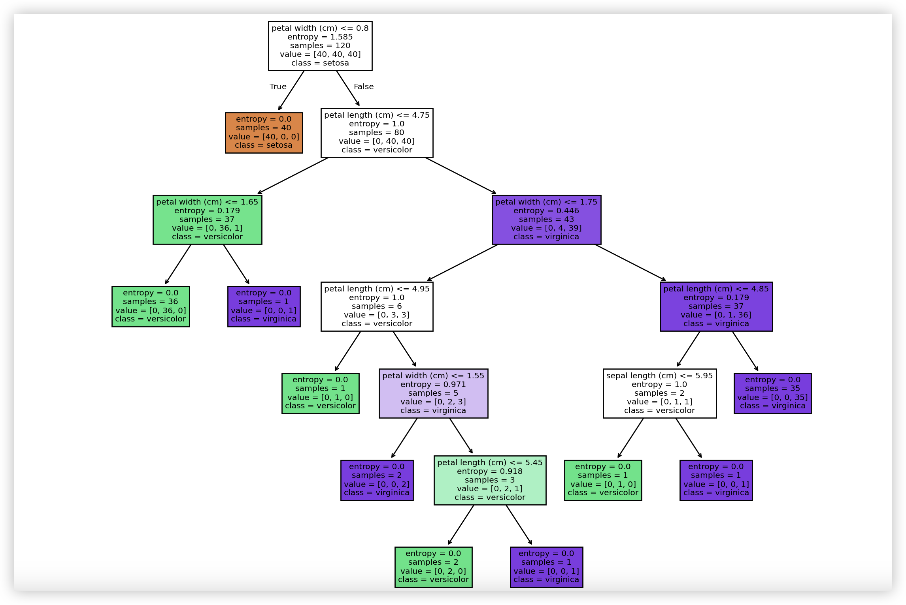
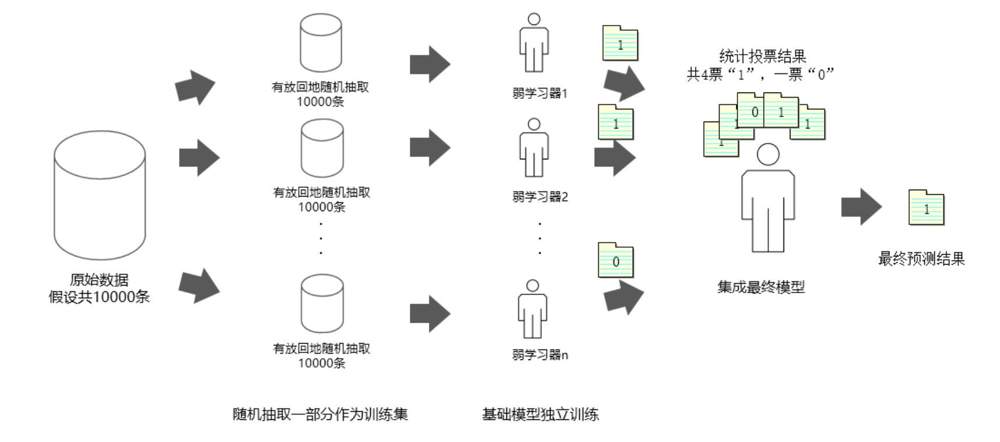

# 决策树和随机森林

**决策树**（Decision Tree）是一种基于树结构的监督学习算法，可用于**分类**和**回归**任务。它通过将数据集逐步分割成不同的子集，直到满足某些停止条件，以此实现预测目标。我们生活中做决策的时候也会用到类似的方法，例如某位女生约见相亲对象的决策方法就可以绘制成如下所示的决策树。


> **说明**：上图仅用于帮助大家理解什么是决策树，无不良引导，也不代表本人的爱情观和婚姻观。

如果具备一定的编程常识，你会发现用决策树做预测的过程相当于是执行了一系列的`if...else...`结构；如果你对概率论的知识更熟悉，那么决策树的构建也可以视为计算以特征空间为前提的条件概率的过程。决策树中的结点可以分为两类：内部结点（上图中蓝色的结点）和叶结点（上图中红色和绿色的结点），其中内部结点对应样本特征属性测试（特征分割条件），而叶结点代表决策的结果（分类标签或回归目标值）。决策树可以用于解决分类问题和回归问题，本章我们仍然把重点放在分类问题上。

## 决策树的构建

### 特征选择

训练决策树模型有三个核心的步骤：特征选择、决策树构建和决策树剪枝。特征选择决定了使用哪些特征来做判断，在训练数据集中，每个样本的属性可能有很多个，不同属性的作用有大有小。特征选择的作用就是筛选出跟分类结果相关性较高的特征，也就是分类能力较强的特征，这样的特征要出现在决策树靠上的位置。如果一个特征能够使得分类后的分支结点尽可能属于同一类别，即该结点有着较高的**纯度**（purity），那么该特征对数据集而言就具备较强的分类能力。这里就产生了第一个问题，我们应该按照什么样的标准来选择分类能力强的特征？在决策树模型中，我们有三种方式来选择分类能力强的特征，分别是：**信息增益**（information gain）、**信息增益比**（gain ratio）和**基尼指数**（Gini index）。

要讲清楚信息增益，我们得先介绍**信息熵**（information entropy）这个概念。1948年，克劳德·香农（_Claude Shannon_）在他的著名论文《通信的数学原理》中提出了“信息熵”的概念，它解决了信息的度量问题，量化出了信息的价值。“熵”原本是热力学领域的概念，它反映的是系统的混乱程度，熵越大，系统的混乱程度就越高。在信息论中，熵可以看作随机变量（数据集）不确定性的度量，熵越大，变量（数据）的不确定性就越大，那么要确定它所需要获取的信息量也就越大；熵越低，数据的纯度就越高，不确定性就越小。

例如，甲、乙两人参加一个射击比赛，如果从历史成绩来看，甲的胜率是100%，那么我们很容易接受甲会获胜这个结果；如果从历史成绩来看，甲的胜率是50%，那么我们就难以确定到底谁会获胜。克劳德·香农提出可以用下面的公式来描述这种不确定性：

$$
H(D) = -\sum_{i = 1}^{k} P(x_i)log_2P(x_i)
$$

其中， $\small{D}$ 代表数据集， $\small{k}$ 代表类别的总数， $\small{P(x\_i)}$ 表示数据集中第 $\small{i}$ 类样本的比例（概率）。我们用 $\small{x\_1}$ 和 $\small{x\_2}$ 来分别表示甲获胜和乙获胜，很显然，当 $\small{P(x\_1)=0.5}$ ， $\small{P(x\_2)=0.5}$ 时， $\small{H=1}$ ，不确定性最大；当 $\small{P(x\_1)=1}$ ， $\small{P(x\_2)=0}$ 时， $\small{H=0}$ ，不确定性最小；当 $\small{P(x\_1)=0.8}$ ， $\small{P(x\_2)=0.2}$ 时， $\small{H \approx 0.72}$ 。

很显然，知道的信息越多，随机变量（数据集）的不确定性就越小。这些信息，可以是直接针对我们想了解的随机事件的信息，也可以是和我们关心的随机事件相关的其他事件的信息。在数学上可以严格的证明这些相关的信息也能够降低或消除不确定性，为此我们定义**条件熵**，它表示在给定特征 $\small{A}$ 的条件下，数据集 $\small{D}$ 的不确定性。条件熵的公式如下所示：

$$
H(D \vert A) = \sum_{v \in A}\frac{\lvert D_{v} \rvert}{\lvert D \rvert}H(D_{v})
$$

上面的公式中，我们让 $\small{v}$ 取得特征 $\small{A}$ 所有可能的取值，其中 $\small{D\_{v\}}$ 代表特征 $\small{A}$ 取值为 $\small{v}$ 的样本子集， $\small{\frac{\lvert D\_{v} \rvert}{\lvert D \rvert\}}$ 代表权重，即特征取值为 $\small{v}$ 的样本比例。可以证明 $\small{H(D) \ge H(D \vert A)}$ ，也就是说多了特征 $\small{A}$ 的信息之后，数据集 $\small{D}$ 的不确定性下降了。当然，还要注意等号成立的情况，也就是说增加了特征 $\small{A}$ 的信息，但是 $\small{D}$ 的不确定没有下降，也就是说我们获取的信息与要研究的内容没有关系。

有了上面的铺垫，接下来我们就可以给出**信息增益**的定义，它是在得到特征 $\small{A}$ 的信息后，数据集 $\small{D}$ 的不确定性减少的程度。换句话说，信息增益是一种描述数据集确定性增加的量，特征的信息增益越大，特征的分类能力就越强，在给定该特征后数据集的确定性就越大。信息增益可以通过下面的数学公式直观的描述：

$$
g(D, A) = E(D) - E(D \vert A)
$$

计算信息熵和信息增益的函数如下所示：

```python
import numpy as np


def entropy(y):
    """
    计算信息熵
    :param y: 数据集的目标值
    :return: 信息熵
    """
    _, counts = np.unique(y, return_counts=True)
    prob = counts / y.size
    return -np.sum(prob * np.log2(prob))


def info_gain(x, y):
    """
    计算信息增益
    :param x: 给定的特征
    :param y: 数据集的目标值
    :return: 信息增益
    """
    values, counts = np.unique(x, return_counts=True)
    new_entropy = 0
    for i, value in enumerate(values):
        prob = counts[i] / x.size
        new_entropy += prob * entropy(y[x == value])
    return entropy(y) - new_entropy
```

经典决策树算法中的 ID3 算法就是基于信息增益进行特征选择的，我们仍然以鸢尾花数据集为例，将数据集拆分为训练集和测试集，在训练集上计算出原始的信息熵以及引入四个特征（花萼长度、花萼宽度、花瓣长度、花瓣宽度）后的信息增益分别是多少，代码如下所示。

```python
from sklearn.datasets import load_iris
from sklearn.model_selection import train_test_split

iris = load_iris()
X, y = iris.data, iris.target
X_train, X_test, y_train, y_test = train_test_split(X, y, train_size=0.8, random_state=3)
print(f'H(D)    = {entropy(y_train)}')
print(f'g(D,A0) = {info_gain(X_train[:, 0], y_train)}')
print(f'g(D,A1) = {info_gain(X_train[:, 1], y_train)}')
print(f'g(D,A2) = {info_gain(X_train[:, 2], y_train)}')
print(f'g(D,A3) = {info_gain(X_train[:, 3], y_train)}')
```

输出：

```
H(D)    = 1.584962500721156
g(D,A0) = 0.9430813063736728
g(D,A1) = 0.5692093930591595
g(D,A2) = 1.4475439590905472
g(D,A3) = 1.4420095891994646
```

> **注意**：如果在划分训练集和测试集的时候，`train_test_split`函数的`random_state`参数跟我上面的代码不同，那么这里的运算结果可能会存在差异。

根据上面的输出我们可以得知，花瓣长度（对应上面的`A2`）这个特征信息增益最高，也就是说使用花瓣长度这个特征分类能力最强，分类后的数据集纯度最高。需要注意的是，当某个特征取值较多时，该特征的信息增益计算结果就会比较大，所以使用信息增益选择特征时，会偏向于取值较多的特征。为了解决这个问题，我们可以计算**信息增益比**，它的定义如下所示：

$$
R(D, A) = \frac{g(D, A)}{E_{A}(D)}
$$

其中， $\small{E\_{A}(D) = -\sum\_{i=1}^{n}{\frac{\lvert D\_{i} \rvert}{\lvert D \rvert}log\_{2}\frac{\lvert D\_{i} \rvert}{\lvert D \rvert\}}}$ ， $\small{n}$ 表示特征 $\small{A}$ 的取值个数，简单的说 $\small{E\_{A}(D)}$ 就是特征 $\small{A}$ 的信息熵，而信息增益比就是特征 $\small{A}$ 的信息增益和特征 $\small{A}$ 的信息熵的比值。我们用下面的函数来计算信息增益比，调用该函数可以输出四个特征对应的信息增益比。

```python
def info_gain_ratio(x, y):
    """
    计算信息增益比
    :param x: 给定的特征
    :param y: 数据集的目标值
    :return: 信息增益比
    """
    return info_gain(x, y) / entropy(x)


print(f'R(D,A0) = {info_gain_ratio(X_train[:, 0], y_train)}')
print(f'R(D,A1) = {info_gain_ratio(X_train[:, 1], y_train)}')
print(f'R(D,A2) = {info_gain_ratio(X_train[:, 2], y_train)}')
print(f'R(D,A3) = {info_gain_ratio(X_train[:, 3], y_train)}')
```

输出：

```
R(D,A0) = 0.19687406476459068
R(D,A1) = 0.14319788821311977
R(D,A2) = 0.28837763858461984
R(D,A3) = 0.35550822529855447
```

> **注意**：如果在划分训练集和测试集的时候，`train_test_split`函数的`random_state`参数跟我上面的代码不同，那么这里的运算结果可能会存在差异。

根据上面的输出我们可以得知，花瓣宽度（对应上面的`A3`）这个特征信息增益比最高，也就是说这个特征能够完成一次良好的数据划分，可以作为我们构建决策树的根结点。当然，构建决策树不可能只做一次划分，我们可以在划分后的数据集上继续计算信息增益比来选择新的划分特征，重复这一过程直到满足一定的条件就可以构造出一棵完整的决策树模型。在经典决策树算法中，C4.5 算法就是基于信息增益比进行特征选择的。

除了上面讲到的信息增益和信息增益比，**基尼指数**也是非常好的特征选择方法，它可以用于评价数据集的纯度。基尼指数也叫**基尼不纯度**（Gini impurity），它的取值在0到1之间，数据集纯度越高，基尼指数越靠近0，数据集纯度越低，基尼指数越靠近1。如果数据集有 $\small{n}$ 个类别，样本属于第 $\small{k}$ 个类别的概率为 $\small{p\_{k\}}$ ，那么数据集的基尼指数可以通过下面的公式进行计算：

$$
G(D) = 1 - \sum_{k=1}^{n}{p_{k}}^{2}
$$

例如鸢尾花数据集中，三种鸢尾花的样本数量都是50条，那么整个数据集的基尼指数为：

$$
G(D) = 1 - [(\frac{1}{3})^{2} + (\frac{1}{3})^{2} + (\frac{1}{3})^{2}] = \frac{2}{3}
$$

如果三种鸢尾花的样本数量分别为100条、25条、25条，那么整个数据集的基尼指数为：

$$
G(D) = 1 - [(\frac{2}{3})^{2} + (\frac{1}{6})^{2} + (\frac{1}{6})^{2}] = \frac{1}{2}
$$

如果三种鸢尾花的样本数量分别为140条、5条、5条，那么整个数据集的基尼指数为：

$$
G(D) = 1 - [(\frac{14}{15})^{2} + (\frac{1}{30})^{2} + (\frac{1}{30})^{2}] = \frac{19}{150}
$$

可以看出，随着数据集纯度越来越高，基尼指数的值越来越小。如果数据集 $\small{D}$ 根据特征 $\small{A}$ 划分为 $\small{k}$ 个部分，那么在给定特征 $\small{A}$ 的前提条件下，数据集的基尼指数可以定义为：

$$
G(D, A) = \sum_{i=1}^{k}\frac{\lvert D_{i} \rvert}{\lvert D \rvert}G(D_{i})
$$

根据上面的公式，我们可以设计出如下所示的计算基尼指数的函数，大家可以对照上面的公式看看是否能够理解下面的代码，或者通过调用下面的函数看看鸢尾花数据集的哪个特征可以对原始数据集或者训练集做出最好的划分。经典决策树算法中的 CART 算法就是基于基尼指数进行特征选择的。

```python
def gini_index(y):
    """
    计算基尼指数
    :param y: 数据集的目标值
    :return: 基尼指数
    """
    _, counts = np.unique(y, return_counts=True)
    return 1 - np.sum((counts / y.size) ** 2)


def gini_with_feature(x, y):
    """
    计算给定特征后的基尼指数
    :param x: 给定的特征
    :param y: 数据集的目标值
    :return: 给定特征后的基尼指数
    """
    values, counts = np.unique(x, return_counts=True)
    gini = 0
    for value in values:
        prob = x[x == value].size / x.size
        gini += prob * gini_index(y[x == value]) 
    return gini


print(f'G(D)    = {gini_index(y_train)}')
print(f'G(D,A0) = {gini_with_feature(X_train[:, 0], y_train)}')
print(f'G(D,A1) = {gini_with_feature(X_train[:, 1], y_train)}')
print(f'G(D,A2) = {gini_with_feature(X_train[:, 2], y_train)}')
print(f'G(D,A3) = {gini_with_feature(X_train[:, 3], y_train)}')
```

输出：

```
G(D,A0) = 0.29187830687830685
G(D,A1) = 0.44222582972582963
G(D,A2) = 0.06081349206349207
G(D,A3) = 0.06249999999999998
```

### 数据分裂

构建决策树的过程是一个递归的过程，通过上面介绍的方法选定特征后就要进行数据分裂，简单的说就是根据该特征将数据集分成两个或多个子集（两个子集对应二叉树，多个子集对应多叉树），每个子集对应于特征的不同取值。接下来，我们对每个子集重复特征选择和数据分裂的动作，直到满足停止条件。停止条件对于递归过程非常重要，同时可以避免生成过于复杂的树结构。常见的停止条件包括：

1. 树达到预设的深度。
2. 当前结点的样本数量少于预设的阈值。
3. 结点上所有样本属于同一个类别。
4. 信息增益或Gini指数的变动低于某个阈值。

> **说明**：如果大家有编写树结构的经验，上面的过程应该很容易理解。当然，对递归（recursion）、二叉树（binary tree）、多叉树（multi-way tree）不熟悉的小伙伴也可以随便找本讲数据结构的书来看看，相关的知识并不复杂，我们这里就不进行赘述了。

在数据分裂的过程中，还有一个值得关注的问题就是特征连续值和缺失值的处理。对于连续值，可以通过遍历特征所有可能的取值，找到切分点 $\small{x}$ 让切分后的子集在信息增益比或基尼指数方面达到最优，在数据分裂时以 $\small{x}$ 将数据划分为 $\small{D\_{1\}}$ 和 $\small{D\_{2\}}$ 两个子集，其中 $\small{D\_{1\}}$ 包含特征值小于等于 $\small{x}$ 的样本， $\small{D\_{2\}}$ 包含特征值大于 $\small{x}$ 的样本。对于缺失值，C4.5 算法采用了加权分配的方式进行处理，当选择一个特征进行分裂时，该特征存在缺失值的样本会被分配到每个子集，但是不同的子集中该样本被赋予的权重是不一样的，这个权重会根据该特征在各个类别中的比例进行计算。CART 算法在处理缺失值时，通常会为每个特征创建一个默认分支。对于存在缺失值的样本，CART 算法会将它们引导到默认分支进行处理，在计算基尼指数时，CART 算法可以选择是否将缺失值的样本纳入计算。

### 树的剪枝

对于一棵较为复杂的决策树进行剪枝是很有必要的，剪枝可以减少树结构的复杂性，同时也避免了过拟合的风险。常用的剪枝策略包括：

1. **后剪枝**（post-pruning）。后剪枝顾名思义是在决策树构建完成后，通过评估和移除一些不必要的分支来简化树结构。后剪枝的过程通常从叶结点开始，至底向上评估每个结点，看看将其替换为叶结点（将该结点及其子树剪掉）是否能提高模型的性能（在验证集上的预测效果）。这种方式在减少过拟合风险的同时，还能够较好的保留对数据的拟合能力，但是计算量较大，而且如果没有合适的验证集，剪枝效果就会受到影响。
2. **预剪枝**（pre-pruning）。预剪枝顾名思义是在构建决策树的过程中动态决定是否停止分裂某个结点。通过在分裂前评估当前结点是否应该继续分裂，可以避免生成过于复杂的树，上面我们提到了几种常用的停止条件。预剪枝策略在决策树构建阶段就减少了不必要的分裂，从而降低了模型的复杂性，但是可能存在欠拟合的风险，因为过早停止分裂可能会遗漏潜在的重要决策规则。

## 实现决策树模型

我们可以使用 scikit-learn 中`tree`模块的`DecisionTreeClassifier`和`DecisionTreeRegressor`来实现用于分类和回归的决策树，这里我们重点讨论用于解决分类问题的决策树模型，有兴趣的读者可以自行研究用于解决回归问题的决策树模型。

```python
from sklearn.tree import DecisionTreeClassifier

# 创建模型
model = DecisionTreeClassifier()
# 训练模型
model.fit(X_train, y_train)
# 预测结果
y_pred = model.predict(X_test)
```

下面，我们对比一下预测值和真实值并看看模型的评估报告。

```python
from sklearn.metrics import classification_report

print(y_test)
print(y_pred)
print(classification_report(y_test, y_pred))
```

输出：

```
[0 0 0 0 0 2 1 0 2 1 1 0 1 1 2 0 1 2 2 0 2 2 2 1 0 2 2 1 1 1]
[0 0 0 0 0 2 1 0 2 1 1 0 1 1 2 0 1 2 2 0 2 2 2 1 0 2 2 1 2 1]
              precision    recall  f1-score   support

           0       1.00      1.00      1.00        10
           1       1.00      0.90      0.95        10
           2       0.91      1.00      0.95        10

    accuracy                           0.97        30
   macro avg       0.97      0.97      0.97        30
weighted avg       0.97      0.97      0.97        30
```

> **说明**：大家运行上面的代码看到的输出可能跟我这里并不相同，因为在创建`DecisionTreeClassifier`时有一个控制随机性的参数`random_state`，如果为该参数提供一个确定的整数值，就可以确保你的运行结果是可重复的。

我们可以通过下面的代码来可视化决策树，相信可视化的方式会帮助大家对决策树模型有一个更好的理解。

```python
import matplotlib.pyplot as plt
from sklearn.tree import plot_tree

plt.figure(figsize=(12, 10))
plot_tree(
    decision_tree=model,               # 决策树模型
    feature_names=iris.feature_names,  # 特征的名称
    class_names=iris.target_names,     # 标签的名称
    filled=True                        # 用颜色填充
)
plt.show()
```

输出：


> **注意**：上图中树的根结点的基尼指数跟我们之前计算的数据集的基尼指数完全一致。

我们调整一下`DecisionTreeClassifier`的参数重新创建决策树并对模型进行可视化。

```python
# 创建模型
model = DecisionTreeClassifier(
    criterion='entropy',
    ccp_alpha=0.01,
    
)
# 训练模型
model.fit(X_train, y_train)
# 可视化
plt.figure(figsize=(12, 10))
plot_tree(
    decision_tree=model,               # 决策树模型
    feature_names=iris.feature_names,  # 特征的名称
    class_names=iris.target_names,     # 标签的名称
    filled=True                        # 用颜色填充
)
plt.show()
```

输出：



> **注意**：上图中树的根结点的信息熵跟我们之前计算的数据集的信息熵完全一致。

由此可见，创建`DecisionTreeClassifier`对象时参数不同，生成的决策树也会存在差异。`DecisionTreeClassifier`构造函数的参数就是决策树模型的超参数，其中有几个非常重要的超参数：

1. `criterion`：特征选择（数据分裂质量评估）的标准，可以选择`'gini'`或`'entropy'`，前者代表基尼指数，也是默认值，后者代表信息增益。
2. `max_depth`：树的最大深度，默认值为`None`，如果不设置该参数，会存在过拟合风险。
3. `min_samples_split`：一个内部结点再次分裂所需的最小样本数，默认值为`2`。这个参数可以设置为整数表示最小样本数，也可以设置为浮点数，表示占总样本数的比例。
4. `min_samples_leaf`：叶结点所需的最小样本数，默认值为`1`。将该参数设置为较大的值可以平滑模型，降低过拟合风险。这个参数也可以设置为整数或浮点数，道理同上。
5. `max_features`：用于最佳分裂的特征数，默认值为`None`。这个参数可以设置为整数，表示选择固定数量的特征；可以设置为浮点数，表示选择特征的比例；可以设置为字符串，`'auto'`和`'sqrt'`表示将总的特征数量求平方根，用平方根的值作为选择特征的数量，`'log2'`表示将总的特征数量求对数，用对数值作为选择特征的数量。
6. `class_weight`：指定类别的权重，用于处理类别不平衡问题，默认值为`None`。可以用字典的方式手动设置每个类别的权重，也可以使用`'balanced'`让模型自动调整。
7. `splitter`：选择分裂结点的策略，默认值为`'best'`，表示最佳分裂，还有一个取值是`'random'`，表示随机分裂。
8. `max_leaf_nodes`：限制叶结点的最大数量，可以防止树结构过于复杂。
9. `min_impurity_decrease`：结点分裂所需的最小不纯度降低值，任何结点只有在不纯度减少超过此值时才会进行分裂。
10. `ccp_alpha`：成本复杂度剪枝中的$\small{\alpha}$参数值。这个参数用于控制后剪枝中成本复杂度计算公式中$\small{\alpha}$的值。较小的$\small{\alpha}$值允许更复杂的树，而较大的$\small{\alpha}$值倾向于选择更简单的树。通过调整$\small{\alpha}$，可以找到一个最佳的复杂度和误差之间的平衡点。

我们可以通过之前讲到的网格搜索和交叉验证的方式来对超参数进行调优，有兴趣的读者可以参考下面的代码。

```python
from sklearn.model_selection import GridSearchCV

gs = GridSearchCV(
    estimator=DecisionTreeClassifier(),
    param_grid={
        'criterion': ['gini', 'entropy'],
        'max_depth': np.arange(5, 10),
        'max_features': [None, 'sqrt', 'log2'],
        'min_samples_leaf': np.arange(1, 11),
        'max_leaf_nodes': np.arange(5, 15)
    },
    cv=5
)
gs.fit(X_train, y_train)
```

## 随机森林概述

随机森林是基于决策树的集成学习算法，所谓集成学习就是通过组合多个模型的预测结果来提高整体模型的性能，其核心思想就是多个模型的组合往往比单个模型更有效，通过不同的模型捕捉到数据的不同特征，从而降低模型的过拟合风险（提升模型的泛化能力）。随机森林通过构建多个决策树并将它们的预测结果进行投票（分类）或平均（回归），来提高模型的准确性和鲁棒性，如下图所示。



随机森林的基本工作流程如下：

1. Bootstrap 抽样：从原始训练数据集中随机抽取若干个样本（有放回抽样），形成多个不同的子集，每个子集用于训练一棵决策树。
2. 构建决策树：对于每棵树在进行结点分裂时，不必考虑所有特征，而是随机选择一部分特征实现数据分裂。通过这种方式，随机森林增加了模型的多样性，减少了树之间的相关性。
3. 集成学习：对于分类任务，随机森林通过投票的方式（即多数表决）来决定最终分类的结果；对于回归任务，通常可以对每棵树的预测结果求均值作为最终的预测结果。

随机森林的主要优点体现在：

1. 通过集成多个决策树，能够有效提高模型的准确性。
2. 由于引入了随机性，随机森林通常比单棵决策树更不容易过拟合。
3. 随机森林可以提供特征的重要性评分，帮助理解模型。
4. 能够处理大规模数据集和高维数据。

当然，因为要构建多个决策树，随机森林模型通常比较复杂，在训练模型时对计算资源、内存资源和时间成本的消耗都是更大的。我们可以通过 scikit-learn 库`ensemble`模块的`RandomForestClassifier`类来构造随机森林模型，这里我们仍然使用网格搜索交叉验证的方式来对超参数进行调优，代码如下所示。

```python
from sklearn.ensemble import RandomForestClassifier

gs = GridSearchCV(
    estimator=RandomForestClassifier(n_jobs=-1),
    param_grid={
        'n_estimators': [50, 100, 150],
        'criterion': ['gini', 'entropy'],
        'max_depth': np.arange(5, 10),
        'max_features': ['sqrt', 'log2'],
        'min_samples_leaf': np.arange(1, 11),
        'max_leaf_nodes': np.arange(5, 15)
    },
    cv=5
)
gs.fit(X_train, y_train)
```

> **提示**：上面的代码可能会运行非常长的时间。

随机森林模型的超参数很多跟决策树类似，需要说明的有以下几个超参数：

1. `estimator`：森林中树的数量，简单的说就是用多少个决策树来构造森林。更多的树通常会带来更好的预测效果，但也会增加计算成本。
2. `boostrap`：是否使用 Bootstrap 抽样，默认值为`True`，表示在构建每棵树时使用有放回抽样。
3. `n_jobs`：用于并行运行的任务数，默认值为`None`，表示使用单个处理器核心；设置为`-1`，则可以使用所有可用的处理器核心。

## 总结

决策树是简单有效且易于理解的预测模型，适用于分类和回归任务，但容易发生过拟合且对噪声数据敏感；随机森林通过集成多个决策树提高了泛化能力且对噪声数据不敏感，适合解决复杂问题。在解决实际问题时，可以根据具体场景选择合适的模型，通过调节相关超参数来获得最佳效果，二者的对比如下表所示：

| **属性**     | **决策树**    | **随机森林**  |
| ---------- | ---------- | --------- |
| **模型复杂度**  | 简单         | 较复杂       |
| **抗过拟合能力** | 差          | 强         |
| **计算效率**   | 高          | 较低        |
| **结果稳定性**  | 易受单一数据变化影响 | 稳定        |
| **适用场景**   | 数据较少、简单问题  | 数据较多、复杂问题 |
