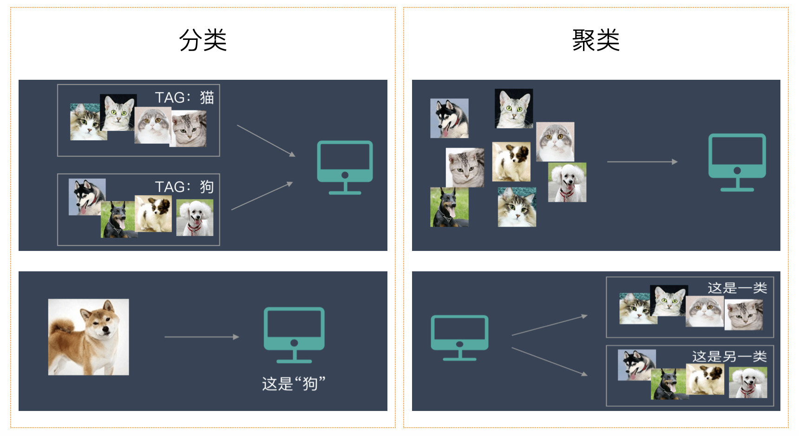
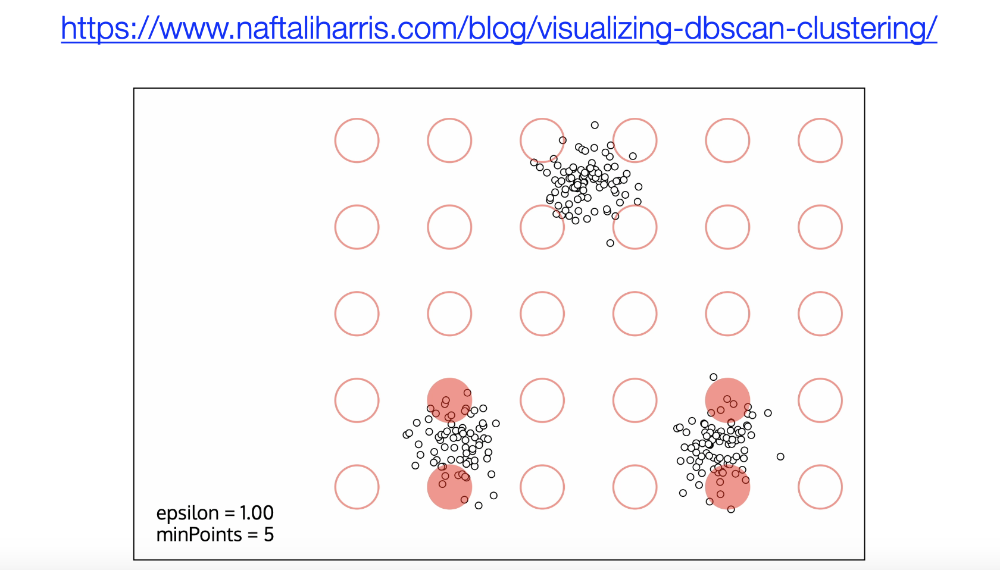

# K-Means聚类算法

聚类（Clustering）是数据挖掘和机器学习中的一种重要技术，用于将数据集中的样本划分为多个相似的组或类别。这种方法在许多领域得到了广泛应用，例如：

* **电商行业**：根据用户行为数据，将消费者分为不同的群体（高消费用户、高活跃用户、流失风险用户、价格敏感用户等）以制定有针对性的运营策略，实现更精准的广告投放，代表性的企业包括阿里巴巴、亚马逊（Amazon）等。
* **金融行业**：各大银行通过聚类算法分析用户的信用记录、收入水平、消费行为等数据，将用户分为不同的风险群体，对于高风险群体需要更严格的信用审核，而低风险群体可以享受更优惠的贷款利率或信用额度。
* **医疗行业**：通过分析患者的健康数据（如病史、基因数据、生活习惯等），将患者分为不同健康风险群体，提高疾病预测的准确性，推动了精准医疗的发展，代表性的公司如强生（Johnson & Johnson）、辉瑞（Pfizer）等。
* **社交媒体**：通过分析用户的好友关系、兴趣爱好、社交互动等数据，将用户划分为不同的社交圈，用于推荐好友、定制个性化内容以及优化了平台上的信息流推荐系统。

聚类是一种**无监督学习**，因为它不需要预先定义的标签，只是根据数据特征去学习，通过度量特征相似度或者距离，然后把已知的数据集划分成若干个不同的类别。与分类不同，聚类任务的目标是发现数据内在的结构。聚类算法大体上可以分为：**基于距离的聚类**、**基于密度的聚类**、**层次聚类**、**谱聚类**等。如果你还分不清楚聚类和分类到底有什么区别，相信下面的图可以帮到你。



## 算法原理

下面我们重点为大家介绍名为 K-Means 的聚类算法。K-Means 是一种基于原型的分区聚类方法，其目标是将数据集划分为K个簇，并使每个簇内的数据点尽可能相似。K-Means 算法的实施步骤如下所示：

1. **初始化簇中心**：随机选择K个样本作为初始簇中心，簇中心通常也称为质心。
2. **分配样本到最近的质心**：计算每个样本与所有质心的距离，将样本分配到最近的簇。
3. **更新质心**：计算每个簇的所有样本的均值，并将其作为新的质心。
4. **重复步骤2和步骤3**，直到质心收敛或达到预设的迭代次数。

## 数学描述

我们将上面的算法原理用数学语言进行描述。对于给定的数据集 ，K-Means 算法的目标是最小化目标函数（总误差平方和）。目标函数如下所示：

$$
J = \sum_{i=1}^{K} \sum_{x \in C_{i}} {\lVert x - \mu_{i} \rVert}^{2}
$$

其中， $\small{K}$ 是簇的数量， $\small{C\_{i\}}$ 表示第 $\small{i}$ 个簇中的样本集合， $\small{\mu\_{i\}}$ 是第 $\small{i}$ 个簇的中心， $\small{x}$ 是数据点。因为这个问题属于 NP 困难组合优化问题，所以在实际求解时我们会采用迭代的方式来寻求满意解。

首先随机选择 $\small{K}$ 个点作为初始质心 $\small{\mu\_{1}, \mu\_{2}, \cdots, \mu\_{K\}}$ ，对于每个数据点 $\small{x\_{j\}}$ ，计算到每个质心的距离，选择距离最近的质心，即：

$$
C_{i} = \lbrace {x_{j} \ \vert \ {\lVert x_{j} - \mu_{i} \rVert}^{2} \le {\lVert x_{j} - \mu_{k} \rVert}^{2} \ \text{for all} \ k \ne i} \rbrace
$$

更新质心为簇中所有点的均值，即：

$$
\mu_{i} = \frac{1}{\lvert C_{i} \rvert}\sum_{x \in C_{i}} x
$$

重复上面两个动作，直到质心不再变化或变化小于某个阈值，这就确保了算法的收敛性。

## 代码实现

下面我们用 Python 代码实现 K-Means 聚类，我们先暂时不使用 scikit-learn 库，主要帮助大家理解算法的工作原理。

```python
import numpy as np


def distance(u, v, p=2):
    """计算两个向量的距离"""
    return np.sum(np.abs(u - v) ** p) ** (1 / p)


def init_centroids(X, k):
    """随机选择k个质心"""
    index = np.random.choice(np.arange(len(X)), k, replace=False)
    return X[index]


def closest_centroid(sample, centroids):
    """找到跟样本最近的质心"""
    distances = [distance(sample, centroid) for i, centroid in enumerate(centroids)]
    return np.argmin(distances)


def build_clusters(X, centroids):
    """根据质心将数据分成簇"""
    clusters = [[] for _ in range(len(centroids))]
    for i, sample in enumerate(X):
        centroid_index = closest_centroid(sample, centroids)
        clusters[centroid_index].append(i)
    return clusters


def update_centroids(X, clusters):
    """更新质心的位置"""
    return np.array([np.mean(X[cluster], axis=0) for cluster in clusters])


def make_label(X, clusters):
    """生成标签"""
    labels = np.zeros(len(X))
    for i, cluster in enumerate(clusters):
        for j in cluster:
            labels[j] = i
    return labels


def kmeans(X, *, k, max_iter=1000, tol=1e-4):
    """KMeans聚类"""
    # 随机选择k个质心
    centroids = init_centroids(X, k)
    # 通过不断的迭代对数据进行划分
    for _ in range(max_iter):
        # 通过质心将数据划分到不同的簇
        clusters = build_clusters(X, centroids)
        # 重新计算新的质心的位置
        new_centroids = update_centroids(X, clusters)
        # 如果质心几乎没有变化就提前终止迭代
        if np.allclose(new_centroids, centroids, rtol=tol):
            break
        # 记录新的质心的位置
        centroids = new_centroids
    # 给数据生成标签
    return make_label(X, clusters), centroids
```

我们仍然以鸢尾花数据集为例，看看我们自己实现的`kmeans`函数能否为将三种鸢尾花划分为三个不同的类别。由于是无监督学习，这里我们直接把整个数据集带入`kmeans`函数，代码如下所示。

```python
from sklearn.datasets import load_iris

iris = load_iris()
X, y = iris.data, iris.target
labels, centers = kmeans(X, k=3)
```

这里，千万不要直接拿`y_pred`和`y`进行比较，我们之前说过，聚类算法并不知道数据对应的标签，它只是根据特征将数据划分为不同的类别，这里输出的`0`、`1`、`2` 并不直接对应到山鸢尾、多彩鸢尾和为吉尼亚鸢尾。我们可以用可视化的方式来看看预测的结果，代码如下所示：

```python
import matplotlib.pyplot as plt

colors = ['#FF6969', '#050C9C', '#365E32']
markers = ['o', 'x', '^']

plt.figure(dpi=200)
for i in range(len(centers)):
    samples = X[labels == i]
    print(markers[i])
    plt.scatter(samples[:, 2], samples[:, 3], marker=markers[i], color=colors[i])
    plt.scatter(centers[i, 2], centers[i, 3], marker='*', color='r', s=120)

plt.xlabel('Petal length')
plt.ylabel('Petal width')
plt.show()
```

输出：


我们用原始数据重新输出，跟上面的图做一个对比，代码如下所示。

```python
import matplotlib.pyplot as plt

colors = ['#FF6969', '#050C9C', '#365E32']
markers = ['o', 'x', '^']

plt.figure(dpi=200)
for i in range(len(centers)):
    samples = X[y == i]
    plt.scatter(samples[:, 2], samples[:, 3], marker=markers[i], color=colors[i])

plt.xlabel('Petal length')
plt.ylabel('Petal width')
plt.show()
```

输出：


直接使用 scikit-learn 库`cluster`模块的`KMeans`类实现 K-Means 聚类是更好的选择，代码如下所示。

```python
from sklearn.cluster import KMeans

# 创建KMeans对象
km_cluster = KMeans(
    n_clusters=3,       # k值（簇的数量）
    max_iter=30,        # 最大迭代次数
    n_init=10,          # 初始质心选择尝试次数
    init='k-means++',   # 初始质心选择算法
    algorithm='elkan',  # 是否使用三角不等式优化
    tol=1e-4,           # 质心变化容忍度
    random_state=3      # 随机数种子
)
# 训练模型
km_cluster.fit(X)
print(km_cluster.labels_)           # 分簇的标签
print(km_cluster.cluster_centers_)  # 各个质心的位置
print(km_cluster.inertia_)          # 样本到质心的距离平方和
```

下面我们对`KMeans`类的几个超参数加以说明：

1. `n_clusters`：指定聚类的簇数，即 $\small{K}$ 值，默认值为`8`。
2. `max_iter`：最大迭代次数，默认值为`300`，控制每次初始化中 K-Means 迭代的最大步数。
3. `init`：初始化质心的方法，默认值为`'k-means++'`，表示从数据中多次随机选取 K 个质心，每次都计算这一次选中的中心点之间的距离，然后取距离最大的一组作为初始化中心点，推荐大家使用这个值；如果设置为`'random'`则随机选择初始质心。
4. `n_init`：和上面的参数配合，指定算法运行的初始化次数，默认值为`10`。
5. `algorithm`：K-Means 的计算算法，默认值为`'lloyd'`。还有一个可选的值为`'elkan'`，表示基于三角不等式的优化算法，适用于 K 值较大的情况，计算效率较高。
6. `tol`：容忍度，控制算法的收敛精度，默认值为`1e-4`。如果数据集较大时，可适当增大此值以加快收敛速度。

## 总结

K-Means 是一种经典的聚类算法，它的优点包括实现简单，算法收敛速度快；缺点是结果不稳定（跟初始值设定有关系），无法解决样本不均衡的问题，容易收敛到局部最优解，受噪声数据影响较大。如果你想通过可视化的方式理解聚类的过程，我们给大家推荐一个名为 Naftali 的人的博客，该网站上提供了可视化的方式展示 K-Means 和 DBSCAN 聚类（一种基于密度的聚类算法），如下图所示。


